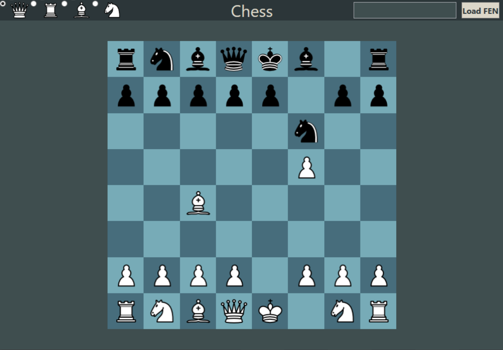

# Chess
Programming II task - Correspondence chess as WPF application.

## Requirements
Microsoft Visual Studio

python 3.7+

python-chess https://github.com/niklasf/python-chess
```
pip install chess
```

## How to use
### Before first use
Before using the application, in `ChessGame.cs` file in function `run_cmd()` change `start.FileName` to absolute path of `python.exe`
This path can be obtained by running following command in cmd:
```
where python
```

### Controls
Figures can be moved using Drag&Drop. (Only valid moves can be played, invalid move results in nothing).
Players change turns after valid move.

King castling is made by DragDropping king on a rook.

To select which piece will promoted pawn change into, tick corresponding radio button in top-left corner.

To play correspondence chess, right-click on chessboard will copy FEN notation of current position into clipboard
and display MessageBox with copied FEN notation.
To load chess position, paste FEN notation in textbox in top-right corner and click `Load FEN` button. (Note: App doesn't check
if given FEN is valid)


## What this app does
* Check if move is valid
* Check for checkmate
* En Passant
* Generate valid FEN (with exception of halfmoves/fullmoves)
* Responsive UI

## What this app doesn't do
- Check for stalemate
- Check for 50-move draw rule or draw by repetition. 



